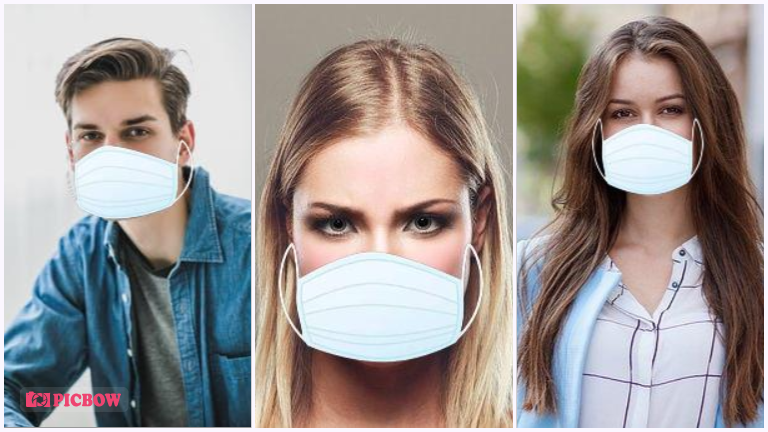
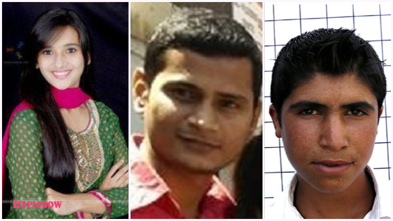
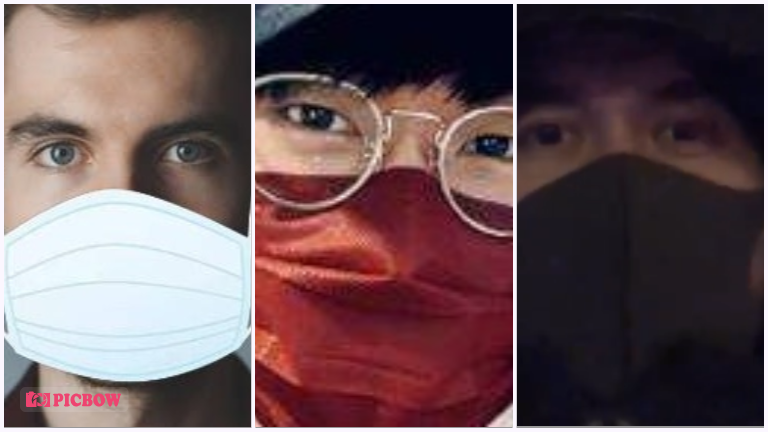
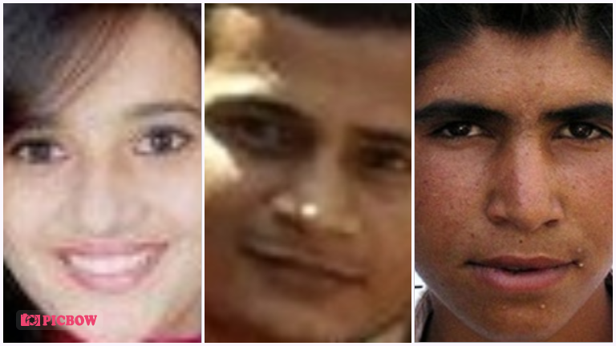

# Face-Mask-Detection
This is a Computer Vision Project for detection if user is wearing face mask or not.

This is a Computer Vision Project which served as one part of my Final Year Project- <strong> Implementation of Face Detection and Object Tracking Techniques to Develop Covid19 Utilities for Face Mask Detection and Social Distancing Violations Detection </strong>

The project features use of Transfer Learning to save time.

# Dataset Used:
For the dataset we used [Prajna](https://github.com/prajnasb)'s Face Mask Detection Dataset and Experiments.

Her dataset looked like this:-

## With Mask:

## Without Mask:

As we can see what she did is to scrape images online and then augment those images by putting a face mask png on top of original images and then using these images.

Since this isn't a good methodology, I scraped a few more images and added to her dataset. The images I scraped included images of people with mask as well in different color masks too.

## Data Preparation:
For preparing the data I first enhanced the images and then used a face detection algorithm to crop out only face part from the images inorder to reduce the image noise and to make sure the model focusses only on the face part and nothing else.

Also it should be noted that, we could've gone with grayscale images but I used a Resnet50 based architecture from Google's Teachable Machine 2.0 for model creation and it works with colored images better in this case. Though we could have tried other models for better results.

After preparation my dataset looks like this:-

### Final Dataset With Mask:

### Final Dataset Without Mask:

# Methodology Used
## Face Mask Detection Use Case:

## Face Mask Detection Architecture:

## Face Mask Detection Flow Chart:

## Face Mask Detection Module Heirarchy Diagram:

# Model Results: 
## Face Mask Detection Model Training Summary:

## Face Mask Detection Model Classification Report:

# Outputs:
## No Mask Output: 

## With Mask Output: 

## Failures:

# To Do:

1. Add Pipelines
2. Model Retraining Support
3. UI Interface
4. Accuracy/Precision/Recall Improvement
5. Deployment
6. Requirements and project documentation

# Inspiration:
In this time of pandemic struck world, I had to do my part as an AI/ML engineer to develop something which can actually be used. Though this project is far from over, but it's the start of something. Later I was able to mentor a team in a hackathon on a similar problem statement as my final year project and this starting guide/code helped them a lot, so it's probably a win - win situation.

# Acknowledgements:
A special thanks to [Adrian Rosebrock](https://github.com/jrosebr1) and his blog at [PyImageSearch](https://www.pyimagesearch.com/) for helping out with this project.

Also thanks to many other github contributors who've worked on similar projects. Thanks for your repos and guidance.

Also a shoutout to [Prajna](https://github.com/prajnasb) for your experiments!
